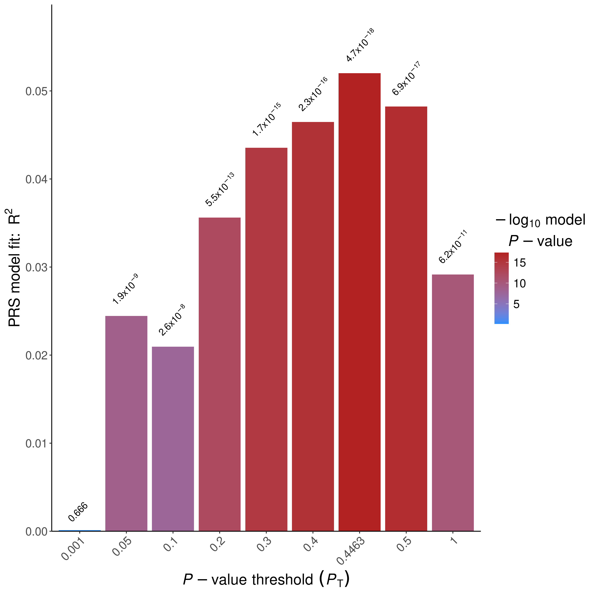
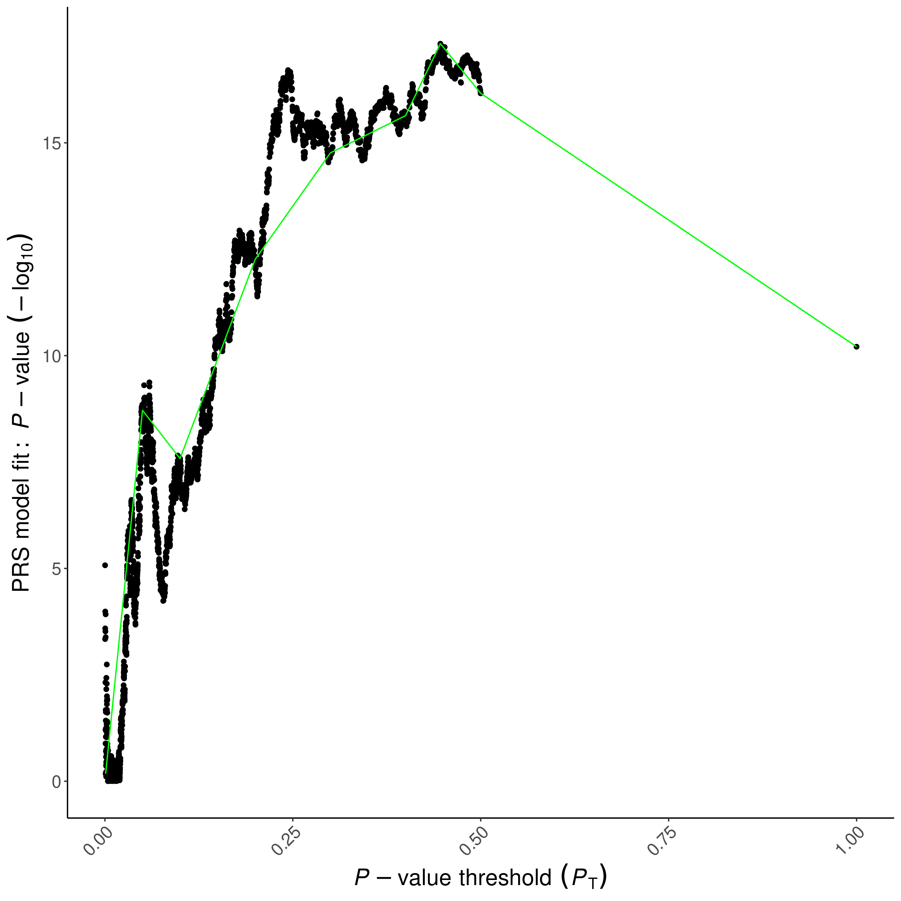

# Polygenic risk score analysis with PRSice-2

To perform polygenic risk score analysis we suggest to use [PRSice](https://choishingwan.github.io/PRS-Tutorial/). In this tutorial we provide a step-by-step guide to perform a simple polygenic risk score analysis using PRSice and explain how to interpret the results. The current tutorial is based on Linux. If you use Windows of Mac, or require additional information refer to the PRSice user manual.

> My additions to the original tutorials are signaled by the use of the blockquote.

## Installation of PRSice-2

PRSice-2 is an R program that can be run in Unix, Linux and Mac OS from the command line. The code used in this tutorial used Linux PRSice version 2.3.5 and was tested on R versions 4.4.2. 

First download and unpack the PRSice software with the following code on the command line.
```bash
wget https://github.com/choishingwan/PRSice/releases/download/2.3.5/PRSice_linux.zip
unzip PRSice_linux.zip
```

## Running a polygenic risk score

To run a polygenic risk score analysis on the toy data provided with PRSice run the following code.

The base parameter refers to the file with summary statistics from the base sample (also known as discovery or training samples). These summary statistics contain for each genetic variant at least an effect size and p-value. The target parameter refers to the prefix of the files (without file extension) that contain the genotype data in binary plink format (i.e., .bed,.bim,.fam file extensions). However, BGEN format is also supported. The base and target sample are also known as validation or test samples. This target sample should be completely independent from the base sample that was used to compute the summary statistics. Sample overlap across the discovery and target sample will greatly inflate the association between the polygenic risk score and the disease trait. 

For the purposes of this tutorial we run the polygenic risk score analysis in PRSice folder where the toy data resides. In more realistic settings the data is likely to be in a separate folder and you can add another line of code with the parameter 'wd data-directory' to change the working directory of PRSice to data-directory. This will also be the directory where PRSice saves its results. Note that '\' characters are used to break up the code in different lines. If you add parameters do not forget to add '\' to all lines except the last one.

If the type of Effect (`--stat`) or data type (`--binary-target`) were not specified, PRSice will try to determine these information based on the header of the base file. 

Instead of performing a polygenic risk score analysis on all genetic variants it is customary to clump first. In clumping, within each block of correlated SNPs the SNP with the lowest p-value in the discovery set is selected and all other SNPs are ignored in downstream analyses. This clumping procedure is performed by PRSice automatically, but can be adjusted with several clumping parameters. Although many other options exist, we refer to the PRSice user manual for more detailed information about the program.

For simplicity sake, we did not include principal components or covariates in this analyses, however, when conducting your own analyses we strongly recommend to include these.

### For binary traits

> `--stat OR` and `--binary-target T` are specific to binary traits.

```bash
Rscript PRSice.R --dir . \
    --prsice ./PRSice_linux \
    --base TOY_BASE_GWAS.assoc \
    --target TOY_TARGET_DATA \
    --thread 1 \
    --stat OR \
    --binary-target T
```

### For quantitative traits

> `--stat BETA`, `beta` and `--binary-target F` are specific to quantitative traits.

```bash
Rscript PRSice.R --dir . \
    --prsice ./PRSice_linux \
    --base TOY_BASE_GWAS.assoc \
    --target TOY_TARGET_DATA \
    --thread 1 \
    --stat BETA \
    --beta \
    --binary-target F
```

## Interpreting the results

By default, PRSice saves two plots and and several text files. The first plot is PRSice_BARPLOT_{date}.png (Figure S1).

<p align="center">

</p>

**Figure S1.** Default PRSice barplot. Nagelkerke R2 and p-value as a function p-value threshold in discovery sample.

This plot shows the predictive value (Nagelkerke's $R^2$) in the target sample of models based on SNPs with p-values below specific thresholds in the base sample. In addition, for each model, a p-value is provided for the null hypothesis that the respective $R^2 = 0$.

As Figure S1 shows, a model using SNPs with a p-value up to 0.4463 achieves the highest predictive value in the target sample with a p-value of 4.69493e-18. However as is often the case in polygenic risk scores analysis with relatively small samples, the predictive value is relatively low (Nagelkerke’s $R^2$ around 5%). The text files include the exact  values for each p-value threshold.

The second plot is PRSice_HIGH-RES_PLOT_{date}.png (Figure S2) shows for many different p-value thresholds the p-value of the predictive effect ($R^2$) in black together with an aggregated trend line in green.

> The green line connects points showing the model fit at the broad P-value thresholds used in the corresponding bar plot are also added.

<p align="center">

</p>

**Figure S2.** Default PRSice high resolution plot. P-value as a function of predictive p-value (black) together with a trend line (green).

Both figures show that many SNPs that affect the trait in the base sample can be used to predict the trait in the target sample. Note that the two traits can be either the same or different. If the same trait is used the predictive value is related to the heritability of the trait (as well as the sample size of the base sample). If different traits are analyzed, the predictive value is also related to the genetic overlap between the two traits. Either way, polygenic risk score analysis typically shows that models with lenient p-value thresholds often predict better than models with more stringent thresholds, suggesting that many statistically insignificant SNPs still have predictive value in polygenic traits.

## Using our data

> The following section was added by me in order to use the data computed in the previous tutorials. To lighten the visualization, we will drop the blockquote even though this is an addition.

We can now use our own data and do a polygenic risk score analysis. We need the results computed in the previous tutorial, that we can copy using the following command:
```bash
# Assuming you are in the 4_PRS directory
cp ../3_Association_GWAS/HapMap_3_r3_13.bim ../3_Association_GWAS/HapMap_3_r3_13.bed ../3_Association_GWAS/HapMap_3_r3_13.fam ../3_Association_GWAS/logistic_results_2.PHENO1.glm.logistic.hybrid ./
```

Since we are working with a binary trait, we will use the binary trait architecture. They are two options that need our input:
* `--base` is the GWAS summary results, which the PRS is based on.
* `--target` is the raw genotype data of target phenotype. It can be in the form of [PLINK binary](https://www.cog-genomics.org/plink2/formats#bed) or [BGEN](http://www.well.ox.ac.uk/~gav/bgen_format/).

The `--base` option will take the result of our GWAS analysis: *logistic_results_2.PHENO1.glm.logistic.hybrid*. However since the format we are using (*.glm.logistic.hybrid*) is different from the default one (*.assoc*), we need to specify which columns to use.

*logistic_results_2.PHENO1.glm.logistic.hybrid* starts with '#' which will be a problem for later. Therefore we need to remove it.
```bash
sed '1s/^#//' logistic_results_2.PHENO1.glm.logistic.hybrid > log_results.glm.logistic.hybrid
```

To differenciate between our results and the toy results, we can specify an exit name with `--out`.

```bash
Rscript PRSice.R --dir . \
    --prsice ./PRSice_linux \
    --base log_results.glm.logistic.hybrid \
    --snp ID --chr CHROM --bp POS --A1 ALT --A2 REF --stat OR --pvalue P \
    --target HapMap_3_r3_13 \
    --thread 1 \
    --stat OR \
    --binary-target T \
    --out log_results
```

These results are terrible, but I believe this is because of the data we have created. The results might be better using real data, and not a simulated binary outcome.

# Conclusion

In this tutorial we discussed how to perform a simple polygenic risk score analysis using the PRSice script and how to interpret its results. When PLINK genotype target files are available, PRSice provides a relatively easy way of performing polygenic risk score analysis. As mentioned before, PRSice offers many additional options to adjust the risk score analysis, including adding covariates and additional principal components and adjusting clumping parameters. We therefore recommend reading the user manual of PRSice to perform a polygenic risk score analysis optimal to the research question at hand.